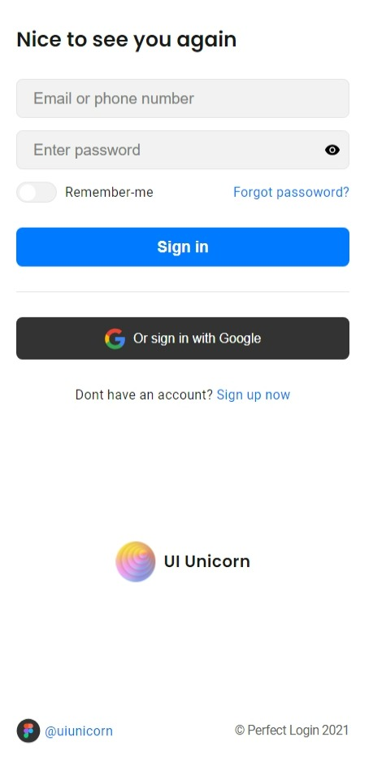

# UI-Unicorn Login Page
Uma página de Login simples. Fiz esse projeto pra aprender sobre acessibilidade em formulários.

🌠 Live Demo: <a href="https://u-dani.github.io/ui-unicorn-login/" target="_blank">https://u-dani.github.io/ui-unicorn-login/</a>  
🖼️ Design by <a href="https://www.figma.com/community/file/1050476989533233612/login-page-perfect-ui-freebie" target="_blank">Kirill Makarov (UI Unicorn)</a>

## 🎬 Screenshots

